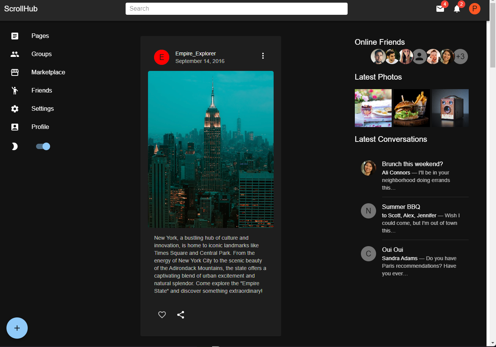
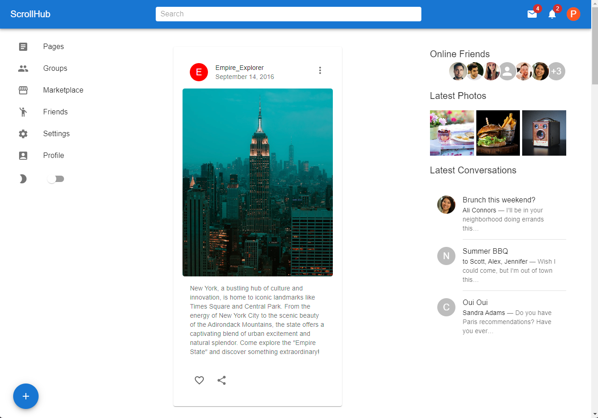

# ScrollHub: A Journey Through Modern Web Design

Welcome to **ScrollHub**, not just a project but a vibrant exploration into the heart of modern web design. Born from the curiosity to delve deeper into the capabilities of Material-UI, ScrollHub emerges as an exemplary testament to what learning through creation looks like in the realm of web development.

## Embark on a Technological Adventure

ScrollHub stands at the crossroads of simplicity and sophistication, where the following technologies converge to weave the fabric of this digital masterpiece:

- **HTML**: The skeleton that gives structure to the web.
- **Material-UI**: A design language that embodies the principles of good design, bringing elegance and usability to the forefront.
- **Node.js**: The powerhouse enabling the back-end magic.
- **React.js**: The soul of ScrollHub, ensuring a seamless, interactive user experience.

## Features: A Glimpse into Innovation

- **Intuitive Scrolling Interface**: Dive into content with ease and elegance.
- **Material-UI Components Mastery**: Experience the beauty and functionality of Material-UI components, meticulously crafted and integrated.
- **Beginner-Friendly Codebase**: Embark on your coding journey with a project that's as educational as it is functional.

## Unleash Your Creativity: Get Started

Your journey with ScrollHub begins here. Follow these steps to clone the cosmos into your local environment:

### Before You Start: The Essentials

- Ensure **Node.js** is installed on your cosmic vessel (your computer).

### Installation: The Launch Sequence

1. **Clone the Repository**
   
   ```bash
   git clone https://github.com/pc9350/ScrollHub.git

2. **Navigate to the Project Directory**

    cd ScrollHub

3. **Install NPM Packages**

    npm install

4. **Start the Development Server**

    npm start

This will start the development server, and you can view the project at http://localhost:3000 (or your configured port) in your preferred browser.

### Screenshots:






**Contact**
Pranav Chhabra - chhabrapranav2001@gmail.com

Project Link: https://github.com/pc9350/MaterialUI_Project